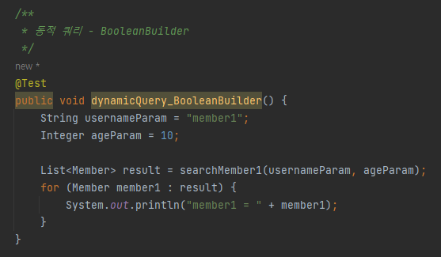
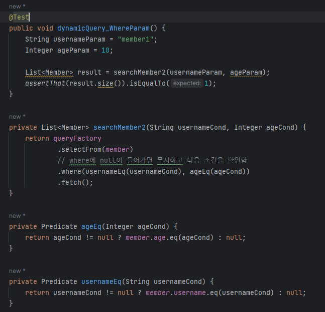
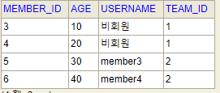
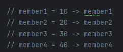

## 1. Querydsl 설정과 검증


- q 파일 생성하기
```
./gradlew compileQuerydsl
gradle -> other -> compileQuerydsl
```

> q파일 생성된 결과는 아래 위치에서 확인할 수 있습니다


<br/><br/>

---
## 엔티티 생성


---
## Q-type 활용
  - 별칭을 직접 입력하는 방법<br/>
```- new QMember("m");```
  - 기본 인스턴스 사용 
  - 같은 테이블을 조인하는 경우를 제외하면 기본 인스턴스를 사용한다.<br/>
```- QMember.member```

querydsl에서 query와 관련된 것은 q타입을 이용합니다.
querydsl은 jpql의 builder 역할을 하는 것입니다.
결국은 jpql로 변하는 것입니다.


<br/><br/>

---
## 정적 쿼리를 이용해서 and 조건을 사용하는 두가지 방법
  - chain을 이용하는 방법
  - ","를 이용하여 연결하는 방법 (null 처리 용이, 동적 쿼리를 만들 때도 사용)




<br/><br/>

---
## 결과 조회를 하는 다양한 방법


<br/><br/>

---
## 정렬
 - 아래와 같이 편하게 정렬할 수 있다.
 - 동적 정렬은 아니라는거..



<br/><br/>

---
## 페이징
 - offset limit을 이용한 paging 활용 방법


<br/><br/>

---
## 집합
 - group by, having 에 관한 함수이다.


<br/><br/>

---
## 기본 조인




<br/><br/>

---
## 세타 조인


