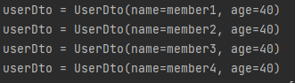

## 1. Querydsl 설정과 검증


- q 파일 생성하기
```
./gradlew compileQuerydsl
gradle -> other -> compileQuerydsl
```

> q파일 생성된 결과는 아래 위치에서 확인할 수 있습니다


<br/><br/>

---
## 엔티티 생성


---
## Q-type 활용
  - 별칭을 직접 입력하는 방법<br/>
```- new QMember("m");```
  - 기본 인스턴스 사용 
  - 같은 테이블을 조인하는 경우를 제외하면 기본 인스턴스를 사용한다.<br/>
```- QMember.member```

querydsl에서 query와 관련된 것은 q타입을 이용합니다.
querydsl은 jpql의 builder 역할을 하는 것입니다.
결국은 jpql로 변하는 것입니다.


<br/><br/>

---
## 정적 쿼리를 이용해서 and 조건을 사용하는 두가지 방법
  - chain을 이용하는 방법
  - ","를 이용하여 연결하는 방법 (null 처리 용이, 동적 쿼리를 만들 때도 사용)


<br/><br/>

---
## 결과 조회를 하는 다양한 방법


<br/><br/>

---
## 정렬
 - 아래와 같이 편하게 정렬할 수 있다.
 - 동적 정렬은 아니라는거..


<br/><br/>

---
## 페이징
 - offset limit을 이용한 paging 활용 방법


<br/><br/>

---
## 집합
 - group by, having 에 관한 함수이다.


<br/><br/>

---
## 기본 조인
- join(조인 대상, 별칭으로 사용할 Q-type)


<br/><br/>

---
## 세타 조인
 - 외부 조인은 기본적으로 불가능 하나, on을 사용하면 외부 조인이 가능하다.


<br/><br/>

---
## On절을 활용한 조인
 - 조인 대상 필터링
 - 연관관계 없는 엔티티 외부 조인
 - innerjoin인 경우는 where이나 on이나 차이가 없다. (leftjoin, rightjoin일 경우만 on절을 사용)

### [ 조인 대상 필터링 ]


- 아래와 같은 결과를 얻을 수 있습니다.


### [ 연관관계 없는 엔티티 외부 조인 ]
 - leftjoin이 일반적인 구조와 다른 것을 살펴볼 수 있다.
 - 일반적인 구조는 leftJoin(member.team, team)


 - member의 이름과 team의 이름이 같을 때만 team의 값을 가져온 결과


<br/><br/>

---
## 페치 조인
 - SQL에서 제공하는 기능이 아님
 - 한방에 가져오기 위함
 - 성능 최적화를 위함

### [ 페치 조인을 사용하지 않은 경우 ]
 - 페치 조인을 사용하지 않은 경우에는 member안에 있는 team이 아직 load 되지 않은 것을 확인할 수 있다.


 - 쿼리를 확인해도 team을 가져오지 않고 있으며, 영속성 컨텍스트에 team이 존재하지 않기 때문에 load가 될 수 없는 상태이다.
 - lazy loading에 의해 사용 시점에 쿼리가 불러와 질 것이다.
 - 물론 select에 team을 넣으면 동일하게 사용할 수 있겠지만,,, 이러한 상황은 자주 발생하지 않는다고 보면 된다.


### [ 페치 조인을 사용하는 경우 ]

 - 페치 조인을 사용하는 경우는 member entity 안에 존재하는 team이 이미 load 된 것을 확인할 수 있다.


 - 쿼리에서도 select 문에 자동으로 team이 들어가 있는 것을 확인할 수 있다.


<br/><br/>

---
## 서브 쿼리

 - subQuery는 JPAExpression을 사용하면 된다.
 - from 절의 서브쿼리 한계
   - JPA, JPQL 서브쿼리의 한계점이며, 당연히 QueryDSL도 지원하지 않는다.
 - from 절의 서브쿼리 해결 방안
   - 서브쿼리를 join으로 변경한다. (가능한 상황도 있고, 불가능한 상황도 있다.)
   - 애플리케이션에서 쿼리를 2번 분리해서 실행한다.
   - nativeSQL을 사용한다.

### [ where절 subQuery ]
 


### [ Select subquery ]


<br/><br/>

---
## case 문
 - case문을 사용하는 것을 지양하길 바라긴 함.
 - 있다는 것 정도만 알고 넘어갈 것
### [ 간단한 case 문 ]


### [ 복잡한 case 문 ]
 - caseBuilder를 이용할 수 있음


<br/><br/>

---
## 상수, 문자 더하기

### [ 상수값 추가 ]
 


### [문자 더하기 ]
 - 의외로 자주 사용하는 곳이 많은 문자 더하기 파트 입니다.
 - type을 맞춰주는 것이 관건입니다.
 - member.age 에 stringValue를 추가해준 것이 포인트입니다.

 - "이름_나이" 로 결과가 나온 것을 확인할 수 있습니다.


<br/><br/>

---
## 프로젝션과 결과 반환 - 기본
 - 프로젝션이란 select 구문에 나열하는 것을 말한다.

### [ 프로젝션 대상이 하나인 경우 ]
 - 타입을 지정할 수 있다.


- 결과는 아래와 같다.


### [ 프로젝션 대상이 둘 이상인 경우 ]
 - DTO 또는 tuple을 사용하여 반환 받아야 한다.
   - 이때 tuple은 QueryDSL에서 제공해주는 인터페이스이다.
   - com.querydsl.core 패키지에서 가지고 온 라이브러리이다.
   - repository 계층에서 사용하는 것은 괜찮디만, service로 넘어가는 것은 좋지 않을 것 같음.
   - tuple도 querydsl에 종속적이기 떄문에 바깥으로 나갈때는 dto로 변환해서 나가는 것을 권장함.


<br/><br/>

---
## 프로젝션 결과 반환 - DTO

- 테스트를 위하여 MemberDto를 만들어줍니다.


### [ JPQL을 이용하여 DTO로 값을 받아오기 ]

 - new operation 방법을 이용하면 JPQL을 이용해서 DTO로 받아올 수 있다.  


### [ QUerydsl을 이용하여 DTO로 값을 받아오기 - Setter ]
 - 이때는 setter와 기본 생성자가 존재해야 한다.
   - 기본 생성자를 이용하여 객체 생성
   - setter를 이용하여 Projections.bean 안에 있는 값들을 설정해준다.


### [ Querydsl을 이용하여 DTo로 값을 받아오기 - field ]
 - getter setter가 필요없다.
 - field가 private이라도 값을 넣을 수 있다.
   - 자바 리플렉션을 이용해도 할 수 있고..


### [ Querydsl을 이용하여 DTO로 값을 받아오기 - 생성자 ]
 - Projections.counstructor에 들어가는 변수 순서와, 생성자의 변수 순서를 맞춰줘야 한다.


### [ 별칭이 다른 경우 - field ]
 - 테스트를 위하여 age와 name을 필드고 갖는 userDto를 생성


 - as로 변수와 필드명을 맞춰줘야 한다.


### [ subQuery로 인하여 별칭이 다른 경우 - field ]


 - 결과는 그대로 나오는 것을 확인할 수 있다.



## * 생성자의 경우는 타입을 맞춰줄 필요가 없다. 대신 DTO에 생성자를 만들어줘야 하는 것을 잊으면 안된다.


<br/><br/>

---
## QueryProjection
 - 궁극의 방법이라고 할 수 있지만 단점도 존재한다.

### [ 장점 ]
 - 컴파일 시점에 오류를 확인할 수 있다.

### [ 단점 ] 
 - q-file을 생성해야 한다는 것
 - dto가 querydsl에 대한 library 의존성이 생긴다.
 - querydsl library를 빼게 되면 영향을 받게 된다.
 - dto 같은 경우에는 controller, service, repository 등 여러 layer에 걸쳐서 사용되는데, querydsl에 의존적으로 설계 되어있다는게 아키텍처적으로 깔끔하지 못하다.


### [ 사용 방법 ]
 - 생성자에 @QUeryProjection 어노테이션을 추가하고
 - Tasks > other > compileQuerydsl을 하여 dto를 Qfile로 만드는 것이다.

 - @QueryProjection 어노테이션 추가


 - Q-file 생성


 - 테스트 코드를 통한 확인


 - Projections.constructor 와의 차이는 컴파일 시점에서는 오류를 잡지 못하고, 런타임 시점에서 문제를 찾을 수 있다.
