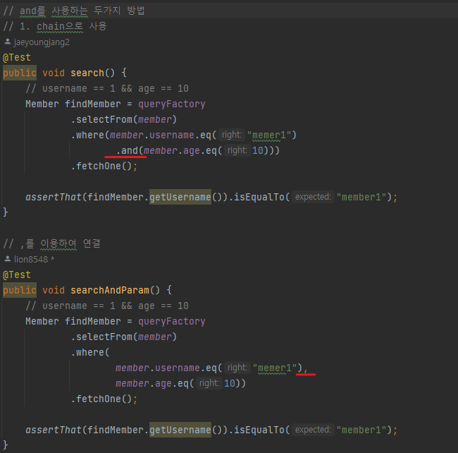
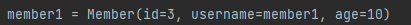

## 1. Querydsl 설정과 검증


- q 파일 생성하기
```
./gradlew compileQuerydsl
gradle -> other -> compileQuerydsl
```

> q파일 생성된 결과는 아래 위치에서 확인할 수 있습니다


---
- 엔티티 생성



---
- Q-type 활용
  - 별칭을 직접 입력하는 방법<br/>
```- new QMember("m");```
  - 기본 인스턴스 사용 
  - 같은 테이블을 조인하는 경우를 제외하면 기본 인스턴스를 사용한다.<br/>
```- QMember.member```

querydsl에서 query와 관련된 것은 q타입을 이용합니다.
querydsl은 jpql의 builder 역할을 하는 것입니다.
결국은 jpql로 변하는 것입니다.
